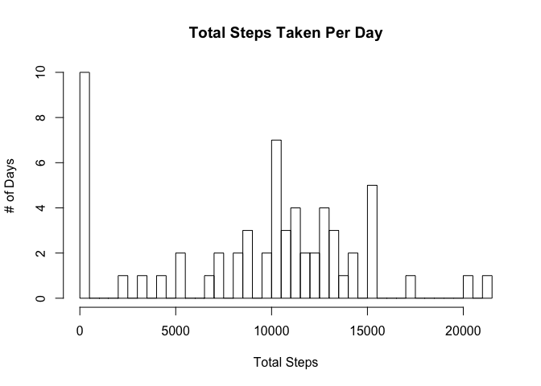
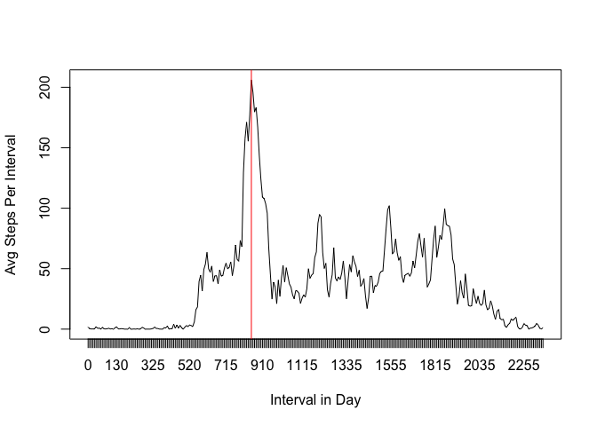
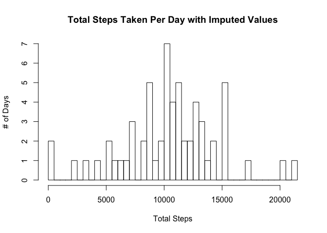
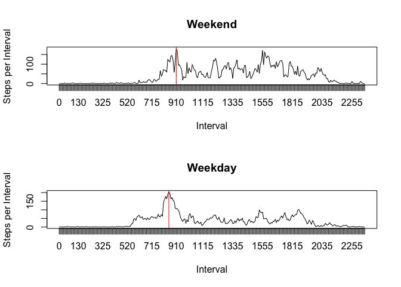

# Reproducible Research: Peer Assessment 1


## Loading and preprocessing the data

```r
setwd("/Users/jason/Dropbox/Code/DataScienceSpecialization/Reproducible/")

library(lubridate)
library(dplyr)
library(mice)

#read the datafile
activityData = read.csv("activity.csv")
#convert date values to actual date data type
activityData$date = ymd(activityData$date)
```

## What is mean total number of steps taken per day?

```r
#summarize total steps per day
StepsByDate = activityData %>%
  group_by(date) %>%
  summarize(TotalSteps = sum(steps, na.rm=TRUE))

#create a histogram of total steps
hist(StepsByDate$TotalSteps, breaks=61,xlab="Total Steps", ylab="# of Days",
     main="Total Steps Taken Per Day")
```



```r
#compute the mean of Total Steps per Day
mean(StepsByDate$TotalSteps)
```

```
## [1] 9354.23
```

```r
#find the median value of Total Steps per Day
median(StepsByDate$TotalSteps)
```

```
## [1] 10395
```


## What is the average daily activity pattern?

```r
#determine average number of steps taken for each daily time interval
AvgStepsPerInterval = tapply(activityData$steps, activityData$interval, mean, na.rm=TRUE)

#show a time series plot of the daily step activity pattern
plot(AvgStepsPerInterval, type="l", xaxt="n",
     xlab="Interval in Day", ylab="Avg Steps Per Interval")
axis(1, at=1:288, labels=unlist(dimnames(AvgStepsPerInterval)))

#draw line showing the time interval with the maximum value
abline(v=which.max(AvgStepsPerInterval), col="red")
```



```r
#find which 5 min interval contains the highest avg # of steps
which.max(AvgStepsPerInterval)
```

```
## 835 
## 104
```
Highest average step interval is the 104th interval which corresponds to the interval starting at 08:35am.

## Imputing missing values

```r
# mice package will only impute on numeric columns so create a dataset without the date values
# to use for imputing missing values
missingVars = activityData
missingVars$date = NULL

# impute missing values, set seed so results can be replicated exactly
set.seed(1234)
imputed = mice(missingVars, m=1, maxit=10)
```

```
## 
##  iter imp variable
##   1   1  steps
##   2   1  steps
##   3   1  steps
##   4   1  steps
##   5   1  steps
##   6   1  steps
##   7   1  steps
##   8   1  steps
##   9   1  steps
##   10   1  steps
```

```r
# put the missing values back into the dataset
fixedVars = complete(imputed)

# add the date values back to the now imputed data
fixedVars$date = activityData$date

# summarize the imputed data by total steps per day as above
FixedStepsByDate = fixedVars %>%
  group_by(date) %>%
  summarize(TotalSteps = sum(steps, na.rm=TRUE))

# create histogram using dataset with imputed values
hist(FixedStepsByDate$TotalSteps, breaks=61,xlab="Total Steps", ylab="# of Days",
     main="Total Steps Taken Per Day with Imputed Values")
```



```r
# compute mean of data with imputed values
mean(FixedStepsByDate$TotalSteps)
```

```
## [1] 10467.56
```

```r
# find the median of the data with imputed values
median(FixedStepsByDate$TotalSteps)
```

```
## [1] 10571
```
Notice that the mean changed more significantly than did the median. This makes sense because the imputed data would replace missing values that would affect the mean more dramatically, however if the imputation process distributed the new values evenly, then the median value would stay relatively close to the same because a nearly equal number of values would have been added above the median as would have been added below the median.

## Are there differences in activity patterns between weekdays and weekends?


```r
# add factor variable showing if observation belongs to a weekend or weekday
fixedVars$isWeekend = as.factor(ifelse((wday(fixedVars$date, label=TRUE) == "Sat" | wday(fixedVars$date, label=TRUE) == "Sun"), "weekend", "weekday"))

# subset data into weekend / weekday datasets for ease of readability when graphing 
# because not using one of the graphics packages that will split easily on factor variables
weekendData = subset(fixedVars, isWeekend=="weekend")
weekdayData = subset(fixedVars, isWeekend=="weekday")

# set up to plot a comparison between weekend and weekday step patterns
par(mfrow=c(2,1), mar=c(5.1,4.1,4.1,2.1))

# plot the weekend time series data
WeekendAvgStepsPerInterval = tapply(weekendData$steps, weekendData$interval, mean)
plot(WeekendAvgStepsPerInterval, type="l", xaxt="n", xlab="Interval", ylab="Steps per Interval", main="Weekend")
axis(1, at=1:288, labels=unlist(dimnames(WeekendAvgStepsPerInterval)))
abline(v=which.max(WeekendAvgStepsPerInterval), col="red")

# plot the weekday time series data
WeekdayAvgStepsPerInterval = tapply(weekdayData$steps, weekdayData$interval, mean)
plot(WeekdayAvgStepsPerInterval, type="l", xaxt="n", xlab="Interval", ylab="Steps per Interval", main="Weekday")
axis(1, at=1:288, labels=unlist(dimnames(WeekdayAvgStepsPerInterval)))
abline(v=which.max(WeekdayAvgStepsPerInterval), col="red")
```



Note from the red lines indicating the interval with the highest average steps that the peak moves to later in the day on weekends than weekdays. Anecdotally this makes sense to me as many people I know like to sleep in a bit on the weekends!
